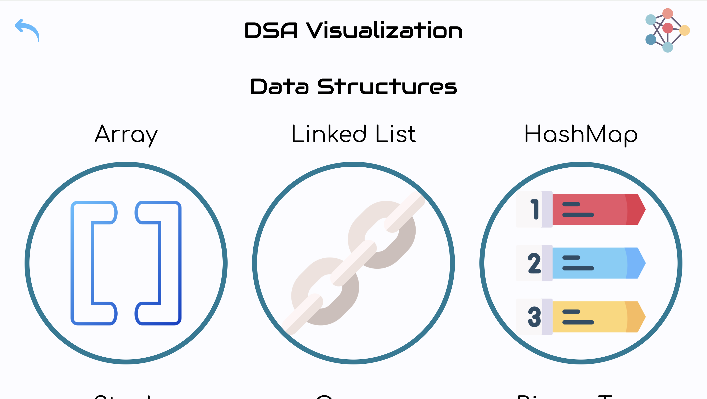

<a id="top"></a>

<div align="center">
    <a href="https://github.com/NestorNebula/dsa-visualization">
        
    </a>
    
<h3>DSA Visualization</h3>
</div>

## About



This project is an application that allows users to visualize Data Structures and Algorithms more easily.

Users can see the representations of different data structures, interact with them as well as creating their own versions of the data structures.

In the Algorithms part, users can use their data structures (or the predefined ones) and look at a visual representation of diverse algorithms execution.

The user's data structures are saved, allowing them to continue their exploration once they return back to the app.

### Built With

[](https://react.dev/)
[](https://www.typescriptlang.org/)
[](https://vite.dev/)
[](https://vitest.dev/)

#### AND

[](https://styled-components.com/)

## Getting Started

### Prerequisites

- NPM

### Installation

1. Fork the [Project repository](https://github.com/NestorNebula/dsa-visualization)
2. Clone the forked repository to your local machine
   ```
   git clone git@github.com:<your username>/<repo name>.git
   ```
3. Update remote URL

   ```
   # SSH:
   git remote add upstream git@github.com:NestorNebula/dsa-visualization.git

   # HTTPS:
   git remote add upstream https://github.com/NestorNebula/dsa-visualization.git
   ```

4. Install required packages
   ```
   npm install
   ```
5. Run the tests
   ```
   npm test
   ```
6. Open the app in development mode
   ```
   npm run dev
   ```

If an error occurs, make sure you have done everything properly according to this guide. If you think so, you can <a href="https://github.com/NestorNebula/dsa-visualization/issues">Open an Issue</a>.

## Contributing

If you find an issue within the app or want to contribute, you can <a href="https://github.com/NestorNebula/dsa-visualization/issues">Open an Issue</a>.

## License

[](https://github.com/NestorNebula/dsa-visualization/blob/main/LICENSE)

## Contact

Noa Houssier

- [Github](https://github.com/NestorNebula)
- [Linkedin](https://www.linkedin.com/in/noahoussier)

## Acknoledgements

- [Material Design Icons](https://pictogrammers.com/library/mdi/)

<p align='right'>(<a href='#top'>go back to the top</a>)</p>
